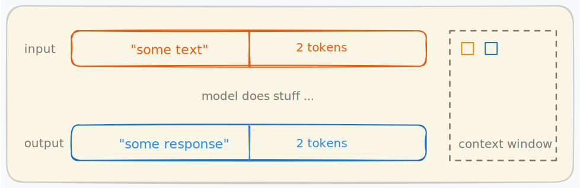
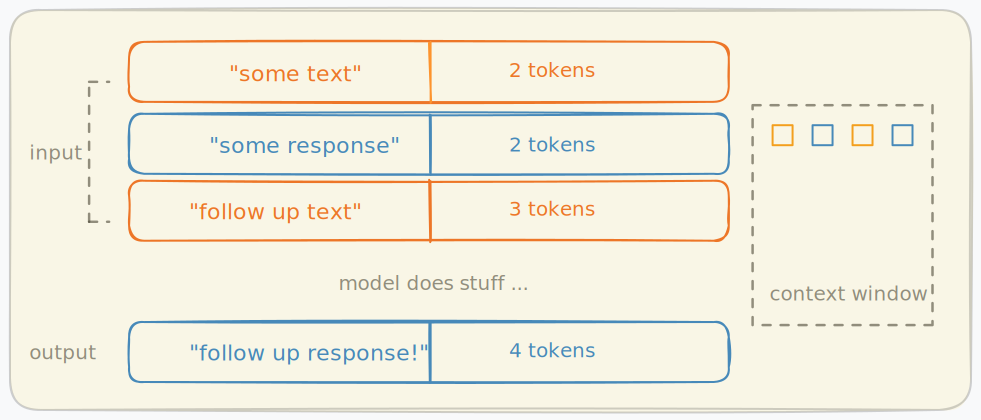
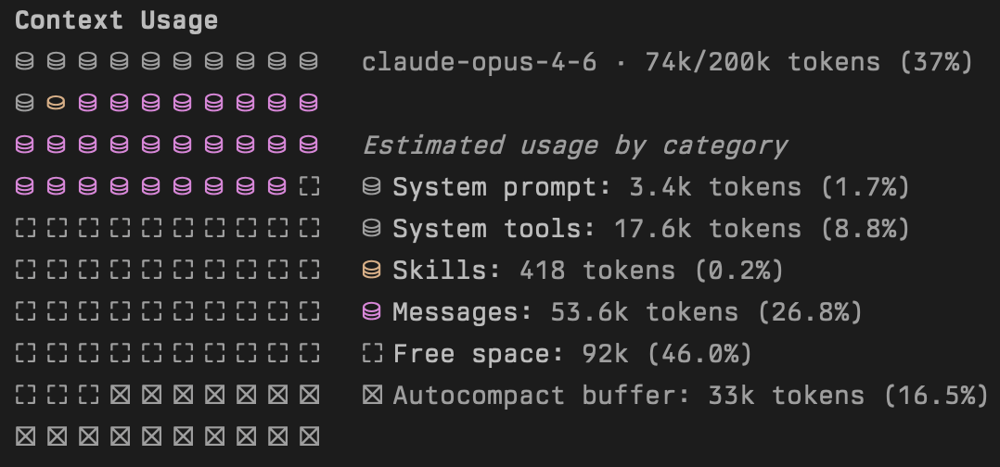

import ModelPricingTable from '@site/src/components/ModelPricingTable';
import Mascot from '@site/src/components/Mascot';

# Context Window

<Mascot src={require('./img/slug_cleaning.png').default} />

The **context window** is the total amount of text (measured in [tokens](./tokens-and-tokenization.md)) that a language model can process in a single request. It includes everything: your input, the model's previous responses, system instructions, and any other context. Think of it as the model's working memory, everything it can "see" when generating a response.

## How a single request works

When you send a message to a model, your input is tokenized (broken into small chunks called tokens) and placed into the context window. The model processes these tokens and generates a response, which also consumes tokens from the context window.

In this example, the input `"some text"` takes up 2 tokens and the model produces `"some response"` using another 2 tokens. The context window (shown on the right) tracks what the model has seen so far.

## Why previous messages stay in the context window

Language models are **stateless** so they don't remember previous conversations on their own. To maintain a coherent multi-turn conversation, every previous message (both your inputs and the model's responses) must be sent back as part of the next request. This means the context window fills up with each exchange.

Here, the second request includes the original input and response *plus* the new follow-up message. The context window now holds 11 tokens (2 + 2 + 3 + 4). As the conversation grows longer, more of the context window is consumed.

This is why long conversations can eventually hit the context limit, meaning the model runs out of space to hold previous exchanges plus a new response.

## What happens as the context window fills up
As your conversation progresses and the context window approaches its limit, several factors change that can impact the quality and reliability of the model's responses. The following plot provides the claimed versus the effective context length of some models. As you can see, the effective context length is much smaller than the claimed one in all models studied.

<small>Source: [A Comprehensive Survey on Long Context Language Modeling](https://arxiv.org/abs/2503.17407)(section 7.1.1 Table 9) </small>

## Context window in practice

Tools like Claude Code show you exactly how the context window is being used. The breakdown typically includes:

- **[System prompt](./system-prompts-and-roles.md)** - instructions that define the model's behavior
- **System tools** - tool definitions available to the model
- **Messages** - the actual conversation history (inputs + outputs)
- **Free space** - remaining capacity for new messages and responses

    
    
<small>Source: Output of <code>/context</code> command in Claude Code v2.1.52</small>

When the context window fills up, the system must either compress older messages, drop them, or start a new conversation. Understanding this helps you write more efficient prompts and manage longer coding sessions.

### Autocompaction

When the context window is nearly full, tools like Claude Code may **autocompact** the conversation (automatically summarizing or dropping older messages to free up space). This keeps the conversation going, but comes with trade-offs:

- **Lost detail** - specific code snippets, file paths, or exact instructions from earlier in the conversation may be compressed into vague summaries
- **Broken references** - if you refer back to something discussed earlier, the model may no longer have access to the original content
- **Repeated work** - the model might re-read files or re-run commands it already performed, because the earlier results were compacted away

You can usually tell autocompaction has occurred when the model seems to "forget" something you discussed a few messages ago, or when it starts asking questions you've already answered.

### Information ambiguity

A full context window means the model is juggling a large amount of information at once. This can lead to:

- **Conflicting instructions** - earlier guidance may contradict later corrections, and the model has to choose which to follow. With more context, there are more opportunities for ambiguity
- **Diluted focus** - with long contexts, important instructions must compete with lots of other content. This can make key requirements less salient unless they are repeated clearly
- **Stale context** - code you discussed at the start of the session may have since been modified. The model might reference outdated versions of files that are still sitting in the context window

### Degraded performance

Large contexts don't just risk information loss and ambiguity, they can reduce overall response quality:

- **Slower responses** - processing more tokens takes more time and costs more per request
- **Lower accuracy** - models perform worse on tasks that require finding specific information buried in long contexts (the ["needle in a haystack"](https://arize.com/blog-course/the-needle-in-a-haystack-test-evaluating-the-performance-of-llm-rag-systems/) problem). Research such as [*Lost in the Middle*](https://arxiv.org/abs/2307.03172) (Liu et al.) and [*Context Rot*](https://research.trychroma.com/context-rot) (Chroma Research) demonstrates that performance degrades as context length increases, with information in the middle of long contexts being particularly hard for models to use
- **Reduced instruction following** - with thousands of tokens of conversation history, the model is more likely to drift from your original intent or constraints

### Practical tips

- **Start fresh sessions** for new tasks rather than continuing a long conversation
- **Be explicit** when referencing earlier context - re-state key details rather than saying "like I mentioned before"
- **Front-load important instructions** - system prompts and key constraints should be at the start, where they're less likely to be compacted
- **Watch the context indicator** - when you're past 50-60% usage, consider whether continuing the session or starting a new one makes more sense

### When this guidance may not apply

- If your task requires long, immutable source material (for example policy bundles), starting a new session can lose useful continuity
- Some tools use retrieval and persistent memory features that reduce, but do not eliminate, context pressure
- For short one-step edits, context optimization has minimal practical impact

<small>Additional sources: <a href="https://docs.anthropic.com/en/api/messages">Anthropic Messages API (stateless multi-turn behavior)</a>, <a href="https://platform.openai.com/docs/guides/conversation-state">OpenAI conversation state guide</a>, <a href="https://docs.anthropic.com/en/docs/claude-code/slash-commands#compact">Claude Code /compact behavior</a>, <a href="https://docs.anthropic.com/en/docs/claude-code/costs">Claude Code costs and context management</a></small>

## Context window limit for popular models

Different models offer different context window sizes and pricing. Larger context windows allow for longer conversations and more code to be analyzed at once, but typically cost more per million token.

<ModelPricingTable />
